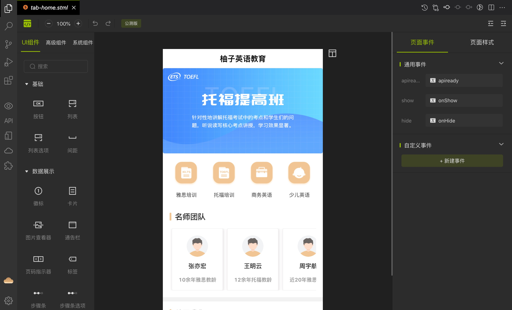
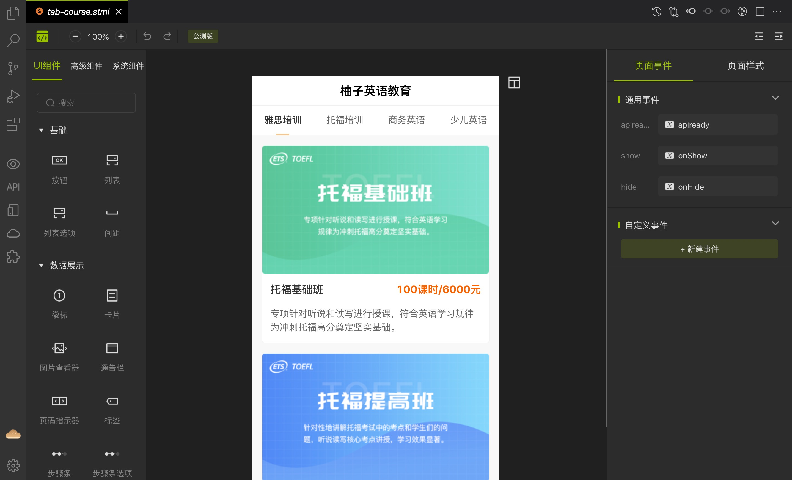
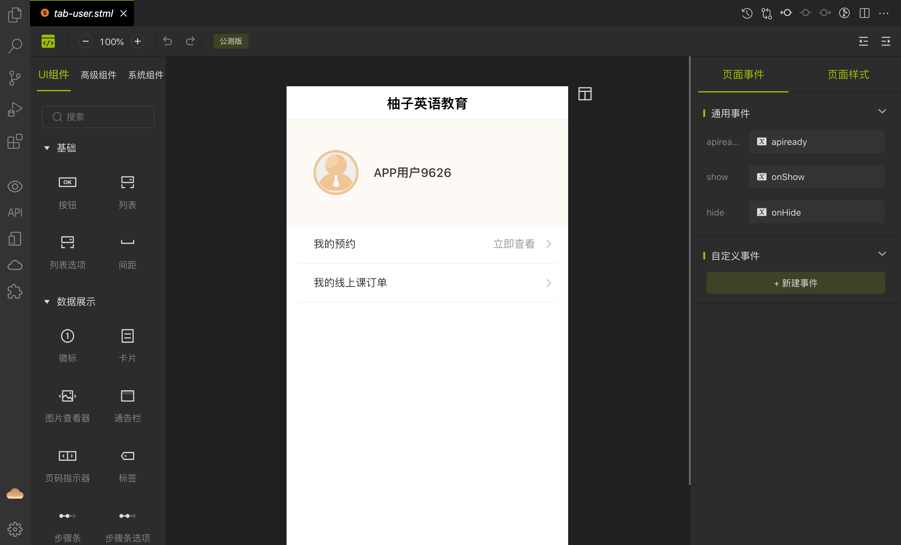
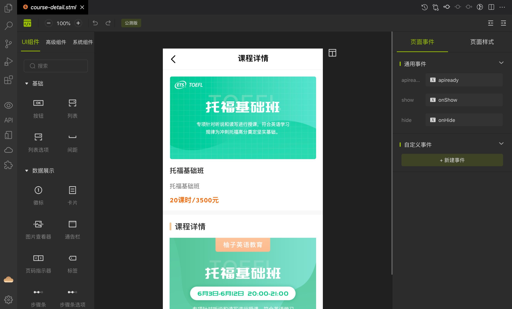
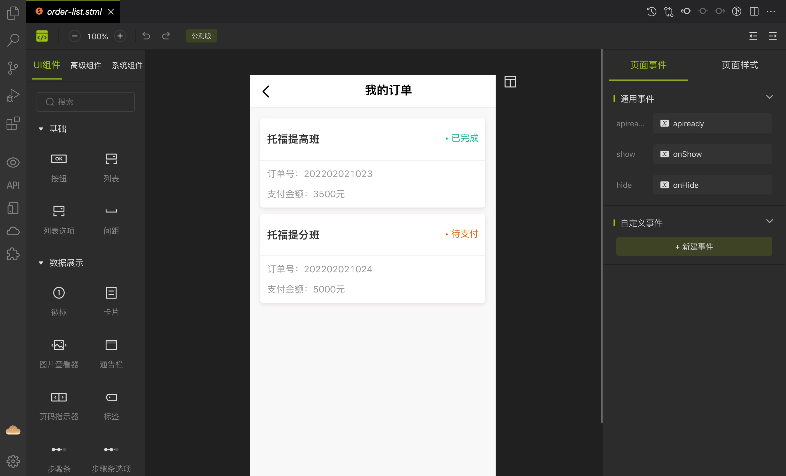
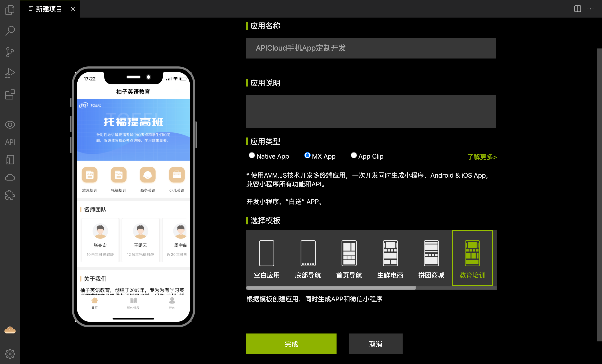
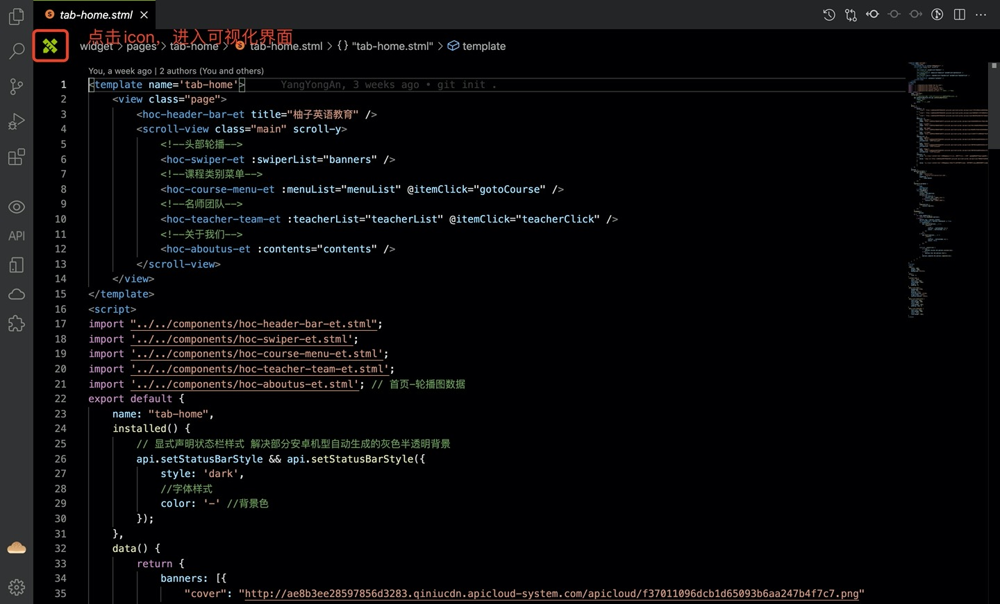
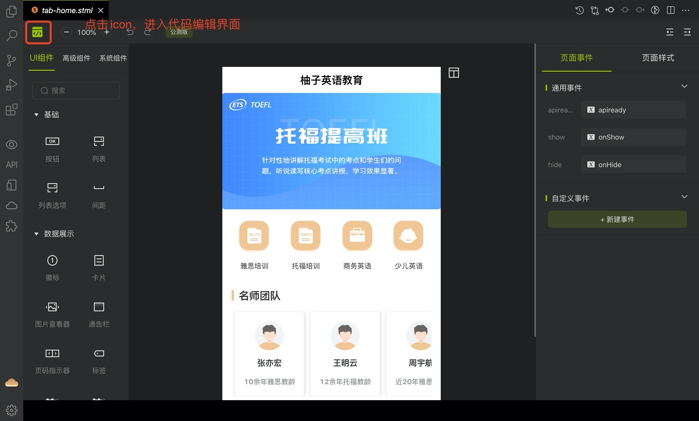

# 项目介绍
## 功能描述

本项目是一个教育培训服务APP。里面涉及到的所有页面都是由APICloud可视化工具中的高级组件进行拼接而成的静态页面，不涉及业务逻辑相关的操作。目的是为了实现在APICloud可视化工具设计界面中能够正常显示页面中的内容。

## 可视化界面显示







## 源码文件目录结构说明

项目源码在widget目录下，该目录下的文件说明如下：
```
┌─component/ // 项目公共组件目录
│ ├─hoc-aboutus-et.stml // [高级组件]关于我们
│ ├─hoc-apply-succ-tip-et.stml // [高级组件]报名成功提示
│ ├─hoc-check-list-et.stml // [高级组件]可选择列表 
│ ├─hoc-course-baseinfo-et.stml // [高级组件]课程基本信息卡片 
│ ├─hoc-course-detail-et.stml // [高级组件]课程详情说明 
│ ├─hoc-course-list-et.stml // [高级组件]课程列表
│ ├─hoc-course-menu-et.stml // [高级组件]课程类别菜单
│ ├─hoc-form-list-et.stml // [高级组件]展示列表信息
│ ├─hoc-handle-btn-et.stml // [高级组件]操作按钮
│ ├─hoc-header-bar-et.stml // [高级组件]头部导航
│ ├─hoc-loading-et.stml // [高级组件]加载中
│ ├─hoc-module-title-et.stml // [高级组件]模块标题
│ ├─hoc-my-order-card-et.stml // [高级组件]我的订单卡片
│ ├─hoc-no-data-et.stml // [高级组件]暂无数据
│ ├─hoc-order-form-et.stml // [高级组件]预约报名表单
│ ├─hoc-order-list-et.stml // [高级组件]订单列表
│ ├─hoc-pay-course-info-et.stml // [高级组件]报名头部课程信息
│ ├─hoc-pay-desc-et.stml // [高级组件]支付信息显示
│ ├─hoc-swiper-et.stml // [高级组件]轮播图
│ ├─hoc-tab-bar-et.stml // [高级组件]底部导航菜单
│ ├─hoc-tab-switch-etstml // [高级组件]tab切换
│ ├─hoc-teacher-team-et.stml // [高级组件]名师团队
│ ├─hoc-user-panel-et.stml // [高级组件]个人信息展示面板
├─images/ // 图片素材图标资源目录 
├─pages/ // AVM页面目录 
│ ├─course-detail/ 
│ │ └─course-detail.stml // 课程详情页 
│ ├─course-list/ 
│ │ └─course-list.stml // 课程列表页 
│ ├─course-pay/ 
│ │ └─course-pay.stml // 购买课程页 
│ ├─course-preorder/ 
│ │ └─course-preorder.stml // 预约课程页 
│ ├─order-detail/ 
│ │ └─order-detail.stml // 用户订单详情页 
│ ├─order-list/ 
│ │ └─order-list.stml // 用户订单列表页 
│ ├─pay-result/ 
│ │ └─pay-result.stml // 下单(支付)结果页 
│ ├─play-video/ 
│ │ └─play-video.stml // 视频播放页 
│ ├─preorder-detail/ 
│ │ └─preorder-detail.stml // 用户预约详情页 
│ ├─preorder-list/ 
│ │ └─preorder-list.stml // 用户预约列表页 
│ ├─tab-home/ 
│ │ └─tab-home.stml // 入口主页 
│ ├─tab-course/ 
│ │ └─tab-course.stml // 课程分类列表 
│ ├─tab-user/ 
│ │ └─tab-user.stml // 用户主页 
├─script/ // JavaScript脚本目录 
│ │ └─couselist.js // 课程列表信息 
│ │ └─req.js // 项目请求交互文件 
└─config.xml // 应用配置文件
```

## 怎么使用可视化工具进行开发

+ 下载最新版的[APICloud Studio 3](https://www.apicloud.com/studio3#downloadBtn)

+ 下载成功后，安装后打开，顶部菜单选择【项目】-【新建项目】，填写应用名称，选择相应模板，点【完成】按钮进行创建。



+ 创建完项目后打开某一个页面，点击左上角图标可切换为可视化界面，可进行页面的设计，左侧栏可根据项目需求拖拽任意组件到画布中，右侧属性设置栏可对拖拽的组件进行设置。具体操作可查看 [可视化工具的使用视频](https://www.apicloud.com/video_play/20_1825)。




## 技术支持

使用中若有任何疑问可到APICloud论坛 [AVM多端](https://developer.yonyou.com/forum-71-1.html) 专区发帖提问。官方技术支持和众多活跃开发者会第一时间为您提供技术支持。


## 项目源码

http://git.yonyou.com/APICloud-CF/education-training_lc
